# Awesome AI Application Engineer

[中文](README.md) | English

> A practical roadmap for AI application engineers: from LLM basics, Prompt Engineering, RAG, Agent, MCP, evaluation, to production deployment.

[](LICENSE)
[](README.en.md)
[](SUMMARY.md)
[](https://yanpengqi7.github.io/awesome-ai-application-engineer/)

**A hands-on learning repository for developers who want to build reliable LLM applications, not just demos.**

This repository brings together learning paths, core concepts, practical tutorials, checklists, templates, bad cases, production notes, and interview preparation. The goal is to help you grow from "I can call a model API" to "I can design, evaluate, deploy, and improve an AI application."

> AI application engineer = someone who connects model capabilities to real product and business workflows, while keeping the system stable, observable, controllable, evaluable, and production-ready.

## Quick Links

- Online website: [Website](https://yanpengqi7.github.io/awesome-ai-application-engineer/)
- Bilingual tutorial: [Build a Personal Knowledge Base Assistant](tutorials/build-personal-knowledge-base/en.md)
- Chinese tutorial: [从 0 到 1 构建个人知识库问答助手](tutorials/build-personal-knowledge-base/zh-CN.md)
- RAG production checklist: [RAG Production Checklist](checklists/rag-production-checklist.md)
- Agent safety checklist: [Agent Safety Checklist](checklists/agent-safety-checklist.md)
- Prompt review checklist: [Prompt Review Checklist](checklists/prompt-review-checklist.md)
- RAG bad cases: [RAG Bad Cases](bad-cases/rag-bad-cases.md)
- Projects: [Projects](projects/README.md)
- Examples: [Examples](examples/README.md)

## What This Repository Helps With

- You are new to LLM app development and do not know where to start.
- You understand prompting, but do not know how to build RAG, Agents, or tool calling.
- You can build demos, but do not know how to evaluate, deploy, monitor, and control cost.
- You want to move toward AI application engineering, but need portfolio projects.
- You can explain concepts, but cannot yet describe an end-to-end production system.

## Learning Roadmap

```mermaid
flowchart LR
    A["Start Here<br/>Learning Map"] --> A1["Foundations<br/>API, JSON, Data Flow"]
    A1 --> B["LLM Basics<br/>Token, Context, Hallucination"]
    B --> C["Prompt Engineering<br/>Structured Instructions"]
    C --> D["RAG<br/>Knowledge Base Q&A"]
    D --> E["Agent<br/>Tool Calling and Workflows"]
    E --> F["MCP<br/>Connect Tools and Data Sources"]
    F --> G["Evaluation<br/>Eval Sets and Regression"]
    G --> H["Production<br/>Deploy, Monitor, Control Cost"]
    H --> I["Projects<br/>Portfolio and Interview"]
```



## Learning Path

| Stage | Goal | Recommended Content | Output |
| --- | --- | --- | --- |
| 0. Preparation | Build the learning map and engineering foundation | [Start Here](docs/00-start-here.md), [Foundations](docs/00-foundations.md) | Minimal chat demo and data-flow diagram |
| 1. LLM Basics | Understand model behavior, context, tokens, hallucination, and cost | [LLM Basics](docs/01-llm-basics.md) | Explain what happens in one model API call |
| 2. Prompt Engineering | Design stable, reusable, testable prompts | [Prompt Engineering](docs/02-prompt-engineering.md) | Reusable prompt template |
| 3. RAG | Build document Q&A and knowledge-base systems | [RAG](docs/03-rag.md) | Personal knowledge base assistant |
| 4. Agent | Let models call tools and execute workflows | [Agent](docs/04-agent.md) | Weekly report assistant or coding assistant |
| 5. MCP | Connect tools, data sources, and AI clients through a shared protocol | [MCP](docs/05-mcp.md) | Minimal local MCP server |
| 6. Evaluation | Evaluate quality, stability, safety, latency, and cost | [Evaluation](docs/06-evaluation.md) | Eval dataset and scoring script |
| 7. Production | Deploy with logging, permissions, monitoring, fallback, and cost control | [Production](docs/07-production.md) | Production-ready AI app |
| 8. AI Coding | Use AI coding tools effectively | [AI Coding](docs/08-ai-coding.md) | Personal AI coding workflow |
| 9. Interview | Prepare AI application engineering interviews | [Interview](docs/09-interview.md) | Clear project story |

## Practical Resources

| Type | Resource | Useful For |
| --- | --- | --- |
| End-to-end tutorial | [Personal Knowledge Base Assistant](tutorials/build-personal-knowledge-base/en.md) | Build your first RAG project |
| Web tutorial | [English Web Tutorial](https://yanpengqi7.github.io/awesome-ai-application-engineer/tutorials/personal-knowledge-base/en.html) | Read online |
| Launch checklist | [RAG Production Checklist](checklists/rag-production-checklist.md) | Moving a RAG demo toward production |
| Safety checklist | [Agent Safety Checklist](checklists/agent-safety-checklist.md) | Designing safer tool calling and Agents |
| Prompt checklist | [Prompt Review Checklist](checklists/prompt-review-checklist.md) | Making prompts more stable and testable |
| Failure cases | [RAG Bad Cases](bad-cases/rag-bad-cases.md) | Understanding common RAG failures |
| Architecture template | [AI App Architecture Template](templates/ai-app-architecture-template.md) | Writing project README, design docs, and interview notes |
| Eval template | [Eval Dataset Template](templates/eval-dataset-template.csv) | Creating AI app evaluation datasets |

## Minimal Code Examples

| Example | Covers | Entry |
| --- | --- | --- |
| Minimal RAG | Chunking, retrieval, context-grounded answers | [examples/minimal-rag](examples/minimal-rag/README.md) |
| Tool Calling | Tool schema, function call, result injection | [examples/tool-calling](examples/tool-calling/README.md) |
| Minimal MCP Server | MCP tool definition and local file search | [examples/minimal-mcp-server](examples/minimal-mcp-server/README.md) |

## Recommended Order

```text
Start Here
  -> AI Application Foundations
  -> LLM Basics
  -> Prompt Engineering
  -> RAG
  -> Agent
  -> MCP
  -> Evaluation
  -> Production
  -> Tutorials / Checklists / Bad Cases
  -> Projects
```

## Who This Is For

- Developers learning LLM application development systematically.
- Backend or full-stack engineers moving into AI application engineering.
- Builders working on RAG, Agents, AI assistants, knowledge bases, or automation workflows.
- Candidates preparing for AI application engineer, Agent engineer, or LLM engineer interviews.
- Product, operations, and data people who want to understand the AI app delivery lifecycle.

## Not For

- People who only want to study model training or low-level ML algorithms.
- People who only collect links and do not build projects.
- People expecting to master all AI engineering topics in a few days.

## Contributing

High-quality tutorials, project cases, bad cases, templates, and engineering lessons are welcome. Please read [CONTRIBUTING.md](CONTRIBUTING.md) first.

If this repository helps you, feel free to star it so more developers can find a practical path into AI application engineering.
