# Awesome AI Application Engineer

> 面向中文开发者的 AI 应用工程师学习路线：从 LLM 基础、Prompt、RAG、Agent、MCP 到上线部署。

[](LICENSE)
[](README.md)
[](SUMMARY.md)
[](https://yanpengqi7.github.io/awesome-ai-application-engineer/)

**中文 AI 应用工程师路线图：从 LLM 到 RAG、Agent、MCP 和生产上线。**

这个仓库是一份**新手也能读懂、工程师能直接上手、可以长期更新的 AI 应用开发学习库**。它不追求堆满链接，而是把学习路径、核心概念、项目实战、工程化经验和面试准备放在一起，帮助你从“会调用大模型 API”成长为能独立设计、开发、评测和部署 AI 应用的人。

如果你不知道 AI 应用工程到底学什么，可以先记住这句话：

> AI 应用工程师 = 会把大模型能力接入真实业务，并让它稳定、可控、可评测、可上线的人。

## 快速入口

- 新手从这里开始：[Start Here](docs/00-start-here.md)
- 在线网页版本：[Website](https://yanpengqi7.github.io/awesome-ai-application-engineer/)
- 学习前的基础铺垫：[AI Application Foundations](docs/00-foundations.md)
- 从 0 到 1 教程：Markdown [中文](tutorials/build-personal-knowledge-base/zh-CN.md) / [English](tutorials/build-personal-knowledge-base/en.md)，网页 [中文](https://yanpengqi7.github.io/awesome-ai-application-engineer/tutorials/personal-knowledge-base/zh-CN.html) / [English](https://yanpengqi7.github.io/awesome-ai-application-engineer/tutorials/personal-knowledge-base/en.html)
- 30 天学习任务：[30-Day Plan](checklists/30-day-plan.md)
- RAG 上线检查：[RAG Production Checklist](checklists/rag-production-checklist.md)
- RAG 失败案例库：[RAG Bad Cases](bad-cases/rag-bad-cases.md)
- 项目实战列表：[Projects](projects/README.md)
- 最小代码示例：[Examples](examples/README.md)
- 面试准备：[Interview](docs/09-interview.md)
- 术语速查：[Glossary](docs/10-glossary.md)

## 目录

- [这个仓库解决什么问题](#这个仓库解决什么问题)
- [适合谁](#适合谁)
- [学习路线图](#学习路线图)
- [学习路线](#学习路线)
- [可以直接拿来用的内容](#可以直接拿来用的内容)
- [新手 30 天学习计划](#新手-30-天学习计划)
- [项目实战](#项目实战)
- [怎么使用这个仓库](#怎么使用这个仓库)
- [更新计划](#更新计划)

## 这个仓库解决什么问题

- 新手不知道从哪里开始学大模型应用开发
- 学了 Prompt，但不知道如何做 RAG、Agent 和工具调用
- 做了 demo，却不知道怎么上线、评测和控制成本
- 想转 AI 应用工程师，但缺少清晰作品集
- 面试时能说概念，却讲不出完整工程链路

## 适合谁

- 想系统学习大模型应用开发的程序员
- 已经会写业务代码，但不知道如何进入 AI 应用方向的人
- 正在做 RAG、Agent、AI 助手、企业知识库或自动化工作流的人
- 准备转型 AI 应用工程师、Agent 工程师、LLM 工程师的人
- 产品、运营、数据同学想理解 AI 应用落地链路的人

## 不适合谁

- 只想研究大模型训练和底层算法的人
- 只想收藏资料、不打算做项目的人
- 希望几天内学完所有 AI 工程知识的人

## 学习路线图

```mermaid
flowchart LR
    A["Start Here<br/>学习地图"] --> A1["Foundations<br/>API、JSON、数据流"]
    A1 --> B["LLM Basics<br/>Token、上下文、幻觉"]
    B --> C["Prompt Engineering<br/>结构化指令与输出"]
    C --> D["RAG<br/>文档问答与知识库"]
    D --> E["Agent<br/>工具调用与任务执行"]
    E --> F["MCP<br/>连接工具和数据源"]
    F --> G["Evaluation<br/>评测集与质量回归"]
    G --> H["Production<br/>部署、权限、成本、监控"]
    H --> I["Projects<br/>作品集与面试"]
```



## 学习路线

| 阶段 | 目标 | 推荐内容 | 输出物 |
| --- | --- | --- | --- |
| 0. 入门准备 | 建立学习地图、工程基础和工具环境 | [Start Here](docs/00-start-here.md)、[AI Application Foundations](docs/00-foundations.md) | 一个最小聊天 Demo 和一张数据流图 |
| 1. LLM 基础 | 理解模型能力、上下文、Token、幻觉、成本 | [LLM Basics](docs/01-llm-basics.md) | 能解释一次 API 调用发生了什么 |
| 2. Prompt Engineering | 会设计稳定、可复用、可评测的提示词 | [Prompt Engineering](docs/02-prompt-engineering.md) | 一套可复用 Prompt 模板 |
| 3. RAG | 构建知识库、文档问答和检索增强系统 | [RAG](docs/03-rag.md) | 个人知识库问答助手 |
| 4. Agent | 让模型调用工具、规划任务、执行工作流 | [Agent](docs/04-agent.md) | 自动周报或代码助手 |
| 5. MCP | 用统一协议连接工具、数据源和应用 | [MCP](docs/05-mcp.md) | 一个本地 MCP Server |
| 6. Evaluation | 评测回答质量、稳定性、安全性和成本 | [Evaluation](docs/06-evaluation.md) | 一份评测集和评分脚本 |
| 7. Production | 部署、监控、缓存、权限、灰度和成本控制 | [Production](docs/07-production.md) | 可上线的 AI 应用 |
| 8. AI Coding | 用 AI 工具提高开发效率 | [AI Coding](docs/08-ai-coding.md) | 一套个人 AI 编程工作流 |
| 9. Interview | 准备 AI 应用工程面试 | [Interview](docs/09-interview.md) | 可讲清楚的项目经历 |

## 可以直接拿来用的内容

| 类型 | 内容 | 适合谁 |
| --- | --- | --- |
| 端到端教程 | [个人知识库问答助手](tutorials/build-personal-knowledge-base/zh-CN.md) / [Personal Knowledge Base Assistant](tutorials/build-personal-knowledge-base/en.md) | 想跟着做出第一个 RAG 项目的人 |
| 上线清单 | [RAG Production Checklist](checklists/rag-production-checklist.md) | 正在把 RAG demo 推向生产的人 |
| 安全清单 | [Agent Safety Checklist](checklists/agent-safety-checklist.md) | 正在设计工具调用和 Agent 的人 |
| Prompt 清单 | [Prompt Review Checklist](checklists/prompt-review-checklist.md) | 想让 Prompt 更稳定、可评测的人 |
| 失败案例 | [RAG Bad Cases](bad-cases/rag-bad-cases.md) | 想理解 RAG 常见坑和修复方式的人 |
| 架构模板 | [AI App Architecture Template](templates/ai-app-architecture-template.md) | 写项目 README、方案和面试讲解的人 |
| 评测模板 | [Eval Dataset Template](templates/eval-dataset-template.csv) | 准备 AI 应用评测集的人 |

## 最小代码示例

| 示例 | 覆盖能力 | 入口 |
| --- | --- | --- |
| Minimal RAG | 文档切分、检索、基于上下文回答 | [examples/minimal-rag](examples/minimal-rag/README.md) |
| Tool Calling | 工具 schema、函数调用、结果回填 | [examples/tool-calling](examples/tool-calling/README.md) |
| Minimal MCP Server | MCP 工具定义、本地文件搜索 | [examples/minimal-mcp-server](examples/minimal-mcp-server/README.md) |

## 新手 30 天学习计划

| 时间 | 学习目标 | 建议任务 |
| --- | --- | --- |
| 第 1-3 天 | 了解 LLM 基础 | 读 Start Here 和 LLM Basics，完成一次 API 调用 |
| 第 4-7 天 | 掌握 Prompt | 写 5 个结构化 Prompt，做 JSON 输出校验 |
| 第 8-14 天 | 入门 RAG | 完成个人知识库问答助手的最小版本 |
| 第 15-20 天 | 入门 Agent | 给应用加入搜索、读文件或查数据库工具 |
| 第 21-24 天 | 学 MCP | 写一个只读文件搜索 MCP Server |
| 第 25-27 天 | 做评测 | 准备 30 条问题，比较不同 Prompt 和模型效果 |
| 第 28-30 天 | 上线和总结 | 部署应用，写项目 README 和复盘 |

## 项目实战

| 项目 | 你会学到什么 | 难度 | 推荐指数 |
| --- | --- | --- | --- |
| 个人知识库问答助手 | 文档切分、Embedding、向量检索、引用溯源 | 入门 | 5/5 |
| GitHub 仓库代码问答 | 代码索引、结构化检索、上下文压缩 | 中级 | 5/5 |
| AI 简历优化助手 | 多轮对话、结构化输出、评分标准 | 入门 | 4/5 |
| Agent 自动周报助手 | 工具调用、任务规划、日程/邮件/文档集成 | 中级 | 5/5 |
| MCP 本地工具箱 | MCP Server、文件系统、浏览器和数据库工具 | 中级 | 5/5 |
| 企业客服质检系统 | 批量分析、标签体系、评测和人工复核 | 进阶 | 4/5 |

查看完整项目列表：[projects/README.md](projects/README.md)

## 仓库结构

```text
.
├── README.md
├── SUMMARY.md
├── ROADMAP.md
├── checklists/
│   ├── 30-day-plan.md
│   ├── agent-safety-checklist.md
│   ├── prompt-review-checklist.md
│   └── rag-production-checklist.md
├── bad-cases/
│   └── rag-bad-cases.md
├── docs/
│   ├── 00-start-here.md
│   ├── 00-foundations.md
│   ├── 01-llm-basics.md
│   ├── 02-prompt-engineering.md
│   ├── 03-rag.md
│   ├── 04-agent.md
│   ├── 05-mcp.md
│   ├── 06-evaluation.md
│   ├── 07-production.md
│   ├── 08-ai-coding.md
│   ├── 09-interview.md
│   ├── 10-glossary.md
│   └── 11-faq.md
├── projects/
│   └── README.md
├── tutorials/
│   └── build-personal-knowledge-base/
├── examples/
│   ├── minimal-rag/
│   ├── tool-calling/
│   └── minimal-mcp-server/
├── resources/
│   └── awesome-ai-resources.md
├── templates/
│   ├── ai-app-architecture-template.md
│   ├── eval-dataset-template.csv
│   ├── project-readme-template.md
│   └── prompt-template.md
├── CONTRIBUTING.md
└── LICENSE
```

## 怎么使用这个仓库

1. 如果你是新手，从 [Start Here](docs/00-start-here.md) 和 [AI Application Foundations](docs/00-foundations.md) 开始。
2. 如果你想跟着做项目，进入教程：[中文](tutorials/build-personal-knowledge-base/zh-CN.md) / [English](tutorials/build-personal-knowledge-base/en.md)。
3. 如果你已经会调用模型 API，直接进入 [RAG](docs/03-rag.md) 和 [Agent](docs/04-agent.md)。
4. 如果你想做作品集，优先完成 [Projects](projects/README.md) 中的 3 个项目，并使用 [AI App Architecture Template](templates/ai-app-architecture-template.md) 写清楚架构。
5. 如果你要准备面试，把 [Interview](docs/09-interview.md)、[FAQ](docs/11-faq.md) 和 [RAG Bad Cases](bad-cases/rag-bad-cases.md) 过一遍。
6. 如果你想贡献内容，先看 [CONTRIBUTING.md](CONTRIBUTING.md)。

## 更新计划

查看 [ROADMAP.md](ROADMAP.md) 了解这个仓库接下来会补充的内容。

## 推荐学习顺序

```text
Start Here
  -> AI Application Foundations
  -> LLM Basics
  -> Prompt Engineering
  -> RAG
  -> Agent
  -> MCP
  -> Evaluation
  -> Production
  -> Tutorials / Checklists / Bad Cases
  -> Projects
```

## Star 趋势型选题

这个仓库会优先维护这些方向：

- LLM 应用工程最佳实践
- RAG 从 demo 到生产
- Agent 工作流和工具调用
- MCP Server 开发
- AI 编程工具与自动化
- 模型评测、观测和成本优化
- AI 应用工程师面试和作品集

## 贡献

欢迎补充高质量资料、项目案例、踩坑经验和中文教程。请先阅读 [CONTRIBUTING.md](CONTRIBUTING.md)。

如果这个仓库对你有帮助，欢迎 Star。你的 Star 会让更多中文开发者少走弯路。
